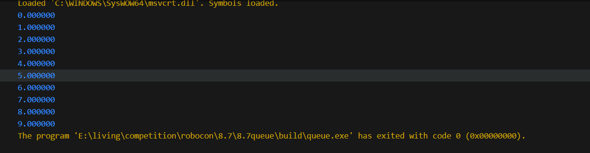

# 程序说明
本程序能实现队列的初始化，入队出队等操作
### 结构定义与函数定义
```C
// 定义队列结构体，主题是浮点数数组，有队头队尾指针
typedef struct queue_t
{
    float data[MAX_SIZE];
    unsigned int head;
    unsigned int tail;
}queue_t;
```
```C
// 队列的初始化，传入队列的指针，将队头队尾指针设定为0
void queue_init(queue_t *queue)
{
    queue->head = 0;
    queue->tail = 0;
};
```
```C
// 入队，传入队列的指针以及入队的数据，若队列已满会返回false
bool enqueue(queue_t *queue, float value)
{
    if(queue_is_full(queue))
    {
        return false;
    }
    else
    {
        queue->data[queue->tail%MAX_SIZE] = value;
        queue->tail++;
    }
};
```
```C
// 出队，传入队列的指针以及出队的数据指针，若队列为空会返回false
bool dequeue(queue_t *queue, float *value)
{
    if (queue_is_empty(queue))
    {
        return false;
    }
    else
    {
        *value = queue->data[queue->head%MAX_SIZE];
        queue->head++;
    }
};
```
```C
// 读队头元素，传入队列的指针和一个浮点数指针，队列为空会报错
bool queue_front(queue_t *queue, float *value)
{
    if (queue_is_empty(queue))
    {
        return false;
    }
    else
    {
        *value = queue->data[queue->head%MAX_SIZE];
    }
};
```
```C
// 判断队列是否满，传入队列指针参数
bool queue_is_full(queue_t *queue)
{
    if(queue->tail-queue->head==MAX_SIZE)
    {
        return true;
    }
    else
    {
        return false;
    }
};
```
```C
// 判断队列是否空，传入队列指针参数
bool queue_is_empty(queue_t *queue)
{
    if(queue->head == queue->tail)
    {
        return true;
    }
    else
    {
        return false;
    }
};
```
```C
int main(int argc, char const *argv[])
{
    queue_t *queue;
    queue_init(queue);
    for(int i = 0; i < 10; i++)
    {
        enqueue(queue, (float)i);
    }
    for(int i = 0; i < 10; i++)
    {
        float temp;
        dequeue(queue, &temp);
        printf("%f\n", temp);
    }
    return 0;

}
```
### 代码测试
```C
// 代码测试，通过循环向队列中加入1~9九个浮点数，然后用循环将其读出
int main(int argc, char const *argv[])
{
    queue_t *queue;
    queue_init(queue);
    for(int i = 0; i < 10; i++)
    {
        enqueue(queue, (float)i);
    }
    for(int i = 0; i < 10; i++)
    {
        float temp;
        dequeue(queue, &temp);
        printf("%f\n", temp);
    }
    return 0;
}
```
#### 运行结果



# 学习记录
- 队列定义及特点
  - **定义**：队列是一种特殊的线性表，特殊之处在于它只允许在表的前端（front）进行删除操作，而在表的后端（rear）进行插入操作，和栈一样，队列是一种操作受限制的线性表。进行插入操作的端称为队尾，进行删除操作的端称为队头。
  - **特点**：先进先出
  - **基本操作**：队列初始化，入队出队，读取队头元素，判断队列空满状态，队列的销毁
